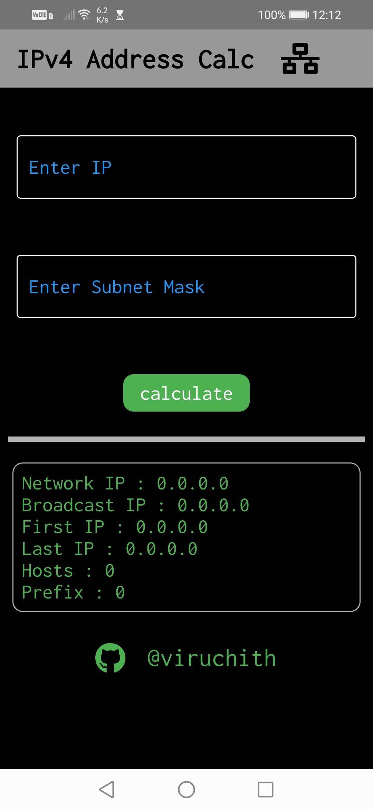
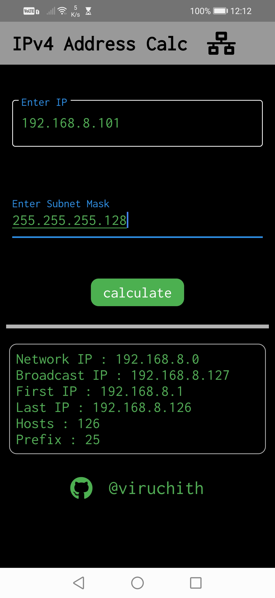
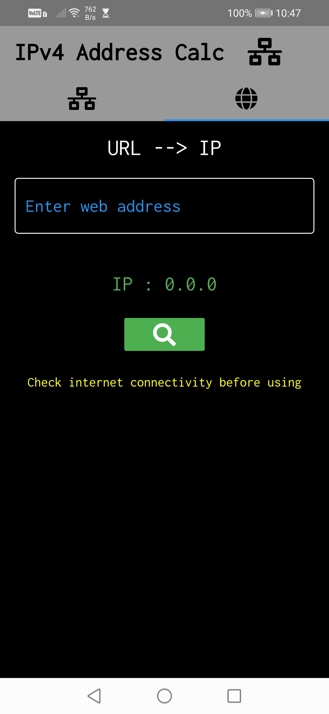

# IPv4 Address Calculator App

A Simple Flutter application to calculate Network IP,Broadcast IP,
First usable IP ,Last Usable IP, Prefix , Hosts for a given 
Ipv4 Address and Subnet Mask.

## Getting Started

You can download the Android app by clicking the link below.  

- [Download: Click here to Download the  app](https://drive.google.com/file/d/1zUyHlVdvAxQEHPuVChklk6HO-DhGZykj/view?usp=drivesdk)

## Overview

  
  
  

  
  
  

