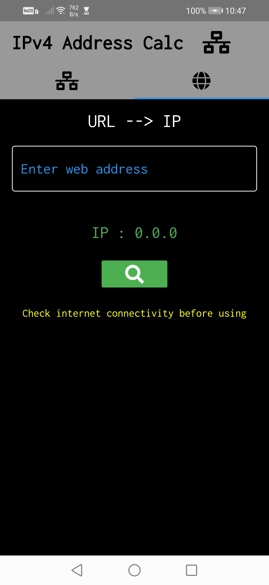
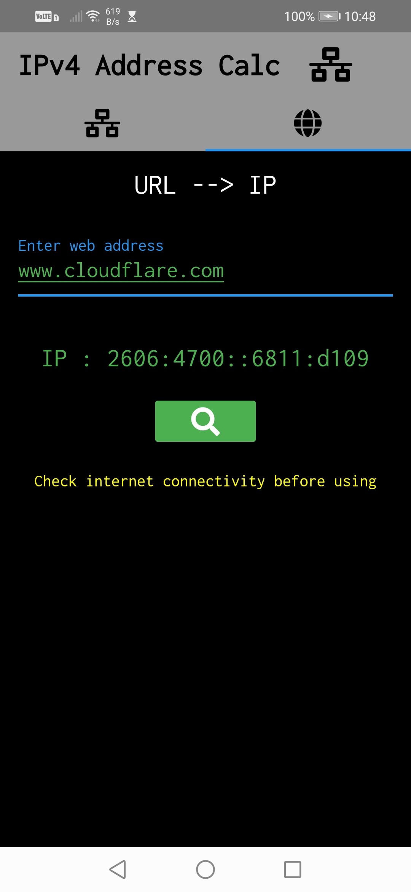

# IPv4 Address Calculator App

A Simple Flutter application to calculate
- Network IP,Broadcast IP
- First usable IP
- Last Usable IP
- Prefix
- Hosts  
   
for a given Ipv4 Address and Subnet Mask.

- URL to IP conversionfeature  is also available .

## Getting Started

You can download the Android app by clicking the link below.  

- [Download: Click here to Download the  app](https://drive.google.com/file/d/1Rrsbr_6HV1iDp0p10RI1ToIL9l8GCIoW/view?usp=sharing)

## Overview  
  
### IPv4 Address calc

  
  
  

  
  
### URL to IP  
  
  

